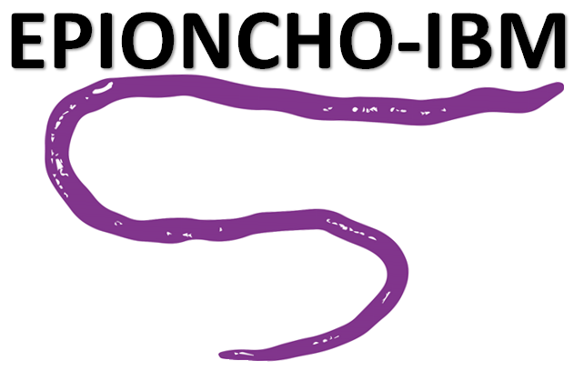

------------------------------------------------------------------------

<!-- badges: start -->
<!-- badges: end -->



<br />

### An individual-based onchocerciasis dynamic model

------------------------------------------------------------------------

## Installation

You can install the development version of EPIONCHO.IBM from
[GitHub](https://github.com/) with:

``` r
# install.packages("devtools")
devtools::install_github("mrc-ide/EPIONCHO.IBM")
```

## Overview

A individual-based, stochastic model of the *Onchocerca volvulus*
transmission system.

``` r
library(EPIONCHO.IBM)
## basic example code
```

What is special about using `README.Rmd` instead of just `README.md`?
You can include R chunks like so:

``` r
#summary(cars)
```

You’ll still need to render `README.Rmd` regularly, to keep `README.md`
up-to-date. `devtools::build_readme()` is handy for this. You could also
use GitHub Actions to re-render `README.Rmd` every time you push. An
example workflow can be found here:
<https://github.com/r-lib/actions/tree/v1/examples>.

You can also embed plots, for example:

In that case, don’t forget to commit and push the resulting figure
files, so they display on GitHub and CRAN.
