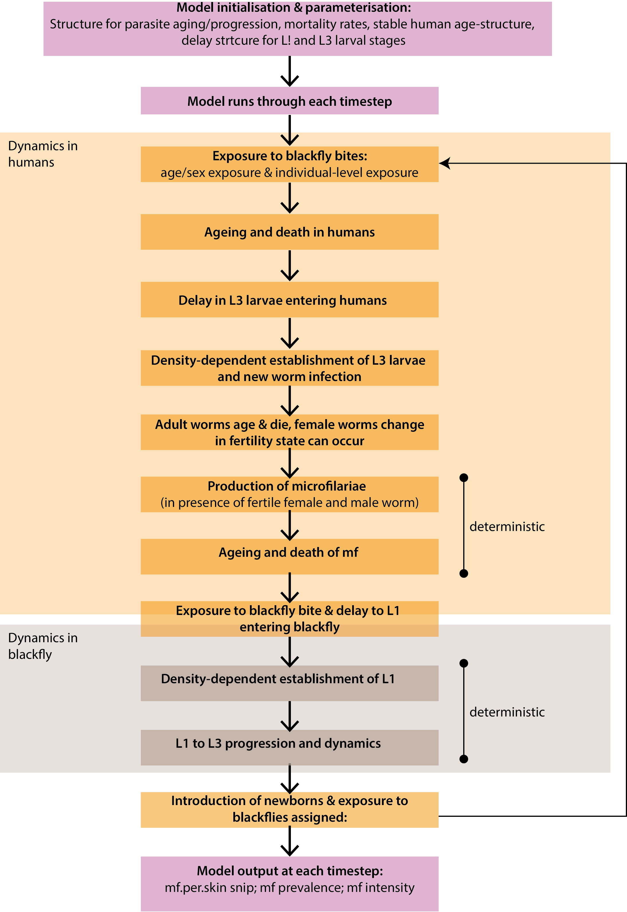
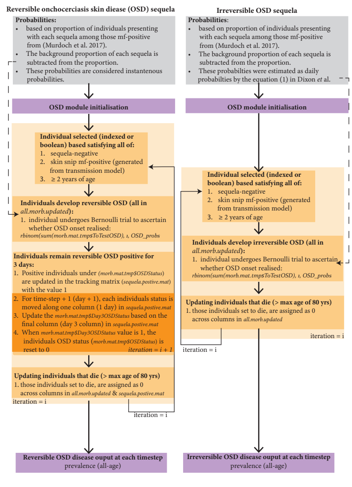
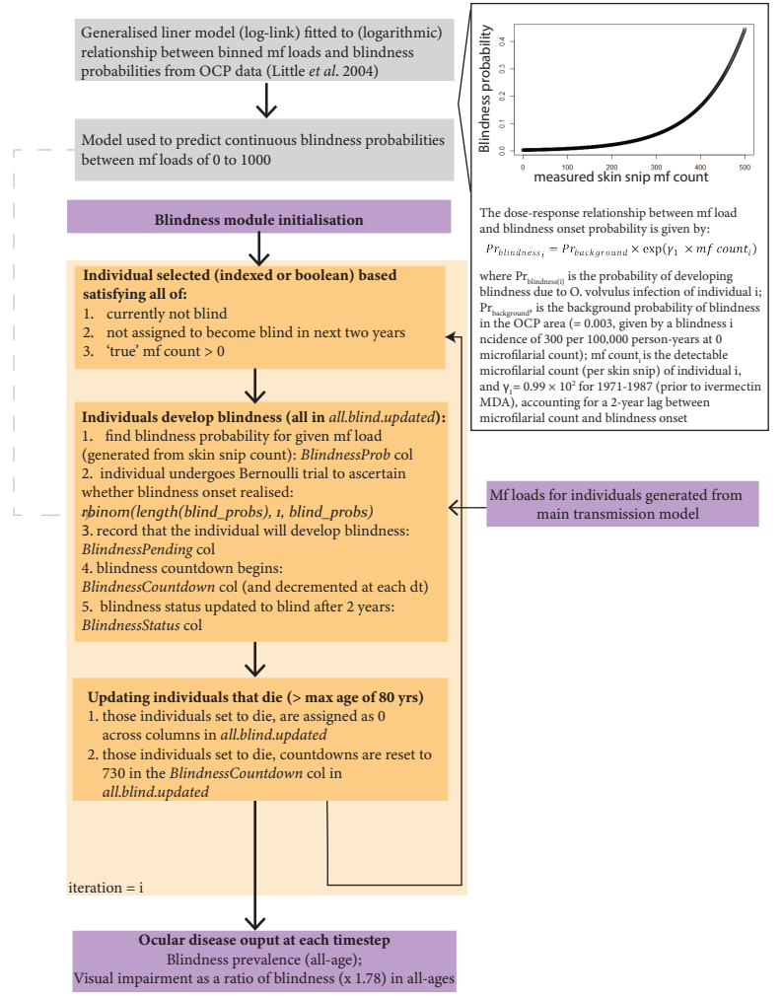
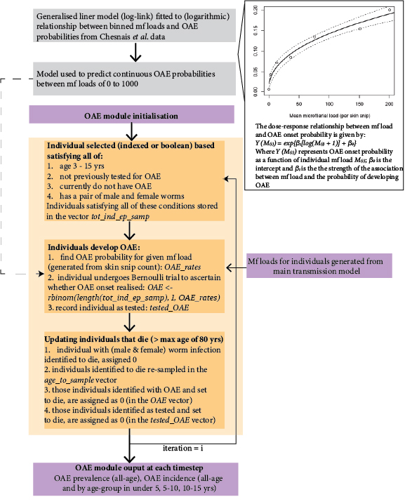

------------------------------------------------------------------------

<!-- badges: start -->
<!-- badges: end -->


<br />

### An individual-based onchocerciasis dynamic model

------------------------------------------------------------------------

## Overview

A individual-based, stochastic model of the *Onchocerca volvulus*
transmission system.

For full model details please see: [Hamley JID, Milton P, Walker M,
Basáñez M-G (2019) Modelling exposure heterogeneity and density
dependence in onchocerciasis using a novel individual-based transmission
model, EPIONCHO-IBM: Implications for elimination and data needs. PLoS
Negl Trop Dis 13(12):
e0007557](https://doi.org/10.1371/journal.pntd.0007557)

The process overview within EPIONCHO-IBM, describing the steps through a
model run which reflect changes in the host/vector and parasite
life-cycle, is presented here:



Other publications utilizing and/or developing EPIONCHO-IBM include:

[Hamley JID, Walker M, Coffeng LE, Milton P, de Vlas SJ, Stolk WA,
Basáñez MG. Structural Uncertainty in Onchocerciasis Transmission Models
Influences the Estimation of Elimination Thresholds and Selection of Age
Groups for Seromonitoring. J Infect Dis. 2020 Jun 11;221(Suppl
5):S510-S518.](https://doi.org/10.1093%2Finfdis%2Fjiz674)

[Walker M, Hamley JID, Milton P, Monnot F, Pedrique B, Basáñez MG.
Designing antifilarial drug trials using clinical trial simulators. Nat
Commun. 2020 Jun
1;11(1):2685.](https://doi.org/10.1038/s41467-020-16442-y)

[Hamley JID, Blok DJ, Walker M, Milton P, Hopkins AD, Hamill LC, Downs
P, de Vlas SJ, Stolk WA, Basáñez MG. What does the COVID-19 pandemic
mean for the next decade of onchocerciasis control and elimination?
Trans R Soc Trop Med Hyg. 2021 Mar
6;115(3):269-280.](https://doi.org/10.1093/trstmh/traa193)

[Stolk WA, Blok DJ, Hamley JID, Cantey PT, de Vlas SJ, Walker M, Basáñez
MG. Scaling-Down Mass Ivermectin Treatment for Onchocerciasis
Elimination: Modeling the Impact of the Geographical Unit for Decision
Making. Clin Infect Dis. 2021 Jun 14;72(Suppl
3):S165-S171.](https://doi.org/10.1093/cid/ciab238)

[Walker M, Hamley JID, Milton P, Monnot F, Kinrade S, Specht S, Pedrique
B, Basáñez MG. Supporting Drug Development for Neglected Tropical
Diseases Using Mathematical Modeling. Clin Infect Dis. 2021 Sep
15;73(6):e1391-e1396. doi:
10.1093/cid/ciab350.](https://doi.org/10.1093%2Fcid%2Fciab350)

## Installation

You can install the development version of EPIONCHO.IBM from
[GitHub](https://github.com/) with:

``` r
# install.packages("devtools")
# install.packages("remotes")
remotes::install_github("mrc-ide/EPIONCHO.IBM")
```

## Running on the Cluster

#### TODO (for developer only): The script can be improved to incpororate the wall time and cpu resource selection within setupForRun.sh

Running EPIONCHO-IBM on an hpc cluster is not too complicated, but scripts have been provided to reduce the workload in doing so.
1. Clone this repo, and specifically, this `rcs` branch, into the cluster. This can be done by using an `ssh` client to remote into the cluster, and then running `git clone -b rcs https://github.com/mrc-ide/EPIONCHO.IBM.git` (if using https authentication) or `git clone -b rcs git@github.com:mrc-ide/EPIONCHO.IBM.git` (if using ssh authentication). For more information on the type of authentication to use, see the [github authentication documentation](https://docs.github.com/en/authentication/keeping-your-account-and-data-secure/about-authentication-to-github#authenticating-with-the-command-line)

2. The run script, where you can define model parameters, intervention, run time, etc. is located in [runModelRCS.R](runModelRCS.R). It is important to note that you should not change the first 4 lines, or the last 3, otherwise the model output may not be saved. Everything else can be edited in this file though.
3. In your terminal/console, make sure that you are in the model directory. You can type `pwd`, which should tell you the current directory your terminal/console is at. You can use `cd folder_name/` to move forwards into a child folder or `cd ../` to move backwards into a parent.
4. One you have completed setting up your run script, then run [create_single_model_run_script.sh](create_single_model_run_script.sh) (this can be run by typing `./create_single_model_run_script.sh` into your terminal). This will create a single file that contains both the EPIONCHO-IBM model code and the run script you created. This file is what will be used by the cluster.
5. In [run.sh](run.sh), you may need to change the top 2 lines based on what you need. Below is a description of each line and what may need to change
```
#PBS -l walltime=00:40:00 - This tells the cluster how long each run of the model will take
#PBS -l select=1:ncpus=1:mem=5gb - This tells the cluster how many CPUs and RAM each run of the model will use
```
6. Now you can set the model to run in the cluster. This can be done with the [setupForRun.sh](setupForRun.sh) script. Certain arguments are needed for the model to run, while others are optional, only if you have deviated from the default build of the model. A typical call to setupForRun.sh will look like:
`./setupForRun.sh -n 300 -o "output" -p 'model_output'`

This will run the model 300 times, and will store the output in a folder called `output/`. Logs will be stored in the `logs/` folder, and the output for each r script will be saved in `rout/`. These folders should all be created once you run `setupForRun.sh`.

The other input parameters for setupForRun are described below:

-f: Model file to run. The default is `all_funcs_combined.R`.
-n: number of iterations you want to run the model for. The maximum value for any given set of simulations is 10,000.
-m: Model folder name, what you have named the github repo. The default is `EPIONCHO.IBM`.
-o: Name of the output folder you want the results saved into. The default is `output`
-p: The prefix you want to label your results in. The default is `test`.
-g: The path to the output file you want to save your processed data in. This should include the name of the file as well (see example in step 8, must have `.rds` extension). Set this if you want to process the data from files located in `-o`, to combine into a single file.
-b: Flag to designate if you want to automate running a post-processing job after running your normal model run. No need for any input.

**IMPORTANT:** If you have not run the model in the cluster before, this script will installed anaconda via miniforge, and create a new environment called `my_r_env`, which will be used for running the model. You may need to provide user input in the terminal (typing `y` to accept the install and creation of the conda environment).

7. Assuming there are no errors, the job will be submitted and a job ID will be printed out, something like `123456[].pbs-7` or `123456.pbs-7`. To simplify the process, you can just use the `./get_job_status.sh` command to see the status of all jobs submitted. You can also use the job id to check the status for a specific job on the cluster with the command `qstat -t [job_id]`. Note that if you have submitted a lot of jobs (i.e -n > 500), using `./get_job_status.sh` will be more useful.

8. For processing the data, you can use the -g and -o parameters as mentioned above. If you want to customize the processing, please look at [process_multiple_runs.R](process_multiple_runs.R). The default time period of output is 4 times a year. An example command would be:
`./setupForRun.sh -g "processed_data/post_processed_data.rds" -o "output"`

Note: Similar to the run.sh file, you may need to modify the header of [run_process_files.sh] to adjust the amount of resources requested. 

9. If you want to automate the process a bit more, the script allows you to both set the model to run, and automatically post-process the data after the model run simulations are done. This can be done via the `-b` flag. In addition to this, you will need to input the same information you inupt for both running the model (step 6) and processing the model (step 8). An example command doing this is:
`./setupForRun.sh -n 300 -o "output" -p "model_output" -g "processed_data/post_processed_data.rds" -b`

## Using EPIONCHO-IBM

For a detailed practical guide please see the [Installing and Running
EPIONCHO-IBM](https://github.com/mrc-ide/EPIONCHO.IBM/blob/master/vignettes/Running_EPIONCHO_IBM.Rmd)
vignette

For a detailed practical guide/demo for running more complex interventions, with variable MDA coverage, variable timing (e.g., some round of annual and biannual MDA),
and inclusion of vector control, please see the [Running complex intervention guide for EPIONCHO-IBM](https://github.com/mrc-ide/EPIONCHO.IBM/blob/master/vignettes/Running_complex_interventions.Rmd) vignette

## Morbidity Extension

EPIONCHO-IBM has been extended to include a OAE module, to simulate OAE prevalence and incidence. Below, we present a flow chart detailing the process overview for the the morbidity module, how this module is parameterised, and how this module connects to the main transmission model. The section below this one describes OAE.


Morbidity Flowchart             |  Eye Disease Flowchart
:-------------------------:|:-------------------------:
  |  


For a detailed practical guide/demo for running the onchocerciasis-associated epilepsy (OAE) module, please see the [Running OAE in EPIONCHO-IBM](https://github.com/mrc-ide/EPIONCHO.IBM/blob/master/vignettes/Running_EPIONCHO_IBM_with_morbidity.Rmd) vignette

## Onchocerciasis-associated epilepsy (OAE) extension

EPIONCHO-IBM has been extended to include a OAE module, to simulate OAE prevalence and incidence. Below, we present a flow chart detailing the process overview for the OAE module, how this module is parameterised (dose-response relationship between mf load and OAE onset probability), and how this module connects to the main transmission model. 



For a detailed practical guide/demo for running the onchocerciasis-associated epilepsy (OAE) module, please see the [Running OAE in EPIONCHO-IBM](https://github.com/mrc-ide/EPIONCHO.IBM/blob/master/vignettes/Running_EPIONCHO_IBM_with_OAE.Rmd) vignette

## Ov16 Extension
EPIONCHO-IBM has been extended to output Ov16 seroprevalence. The seroprevalence outputed was determined by testing hypotheses for seroconversion (ranging from prepatent to patent) and seroreversion (ranging from instant seroreversion to lifelong immunity), as defined in [TBD]. The main model outputs the two best fit hypotheses. While both hypotheses assume seroconversion occurs in the presence of a mating worm pair and the production of any microfilariea, they differ in their seroreversion assumptions, one assuming there is no seroreversion (lifelong immunological memory), and the other with finite immunologicla momery (seroreversion occurs the absence of infection, defined as the absence of worms and larvae in a host).

A practical guide/demo can be found in the [Running Ov16 in EPIONCHO-IBM vignette](https://github.com/mrc-ide/EPIONCHO.IBM/blob/master/vignettes/Running_EPIONCHO_IBM_using_Ov16.Rmd) vignette. The code and a [vignette to run the model with all tested hypotheses](https://github.com/mrc-ide/EPIONCHO.IBM/blob/ov16/vignettes/Running_EPIONCHO_IBM_Ov16.Rmd) can be found in the Ov16 branch.