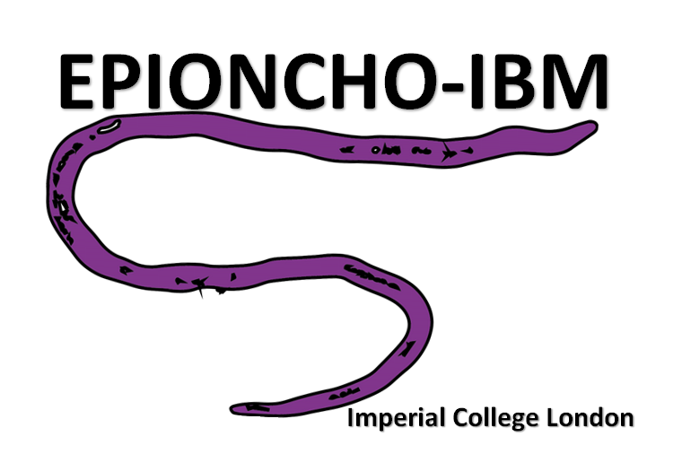

------------------------------------------------------------------------

<!-- badges: start -->
<!-- badges: end -->

 

### An individual-based onchocerciasis dynamic model

------------------------------------------------------------------------
## Note
This is a special snapshot of the model that was used for an analysis of Onchocerciasis Elimination in Togo. As such, it may not look like other versions of the model. This is just to enable replication of the analyses done.

## Overview of files
This repository contains the R code used to generate the results and figures in the main article and supplementary material. The datasets (as marked below) can be found in the related Zenodo repository.

- datasets and simulations.RData [In Zenodo]: All datasets required for the analysis in the main article and its supplementary material. This includes the endemicity survey time series for Togo’s villages (object: E8) and the EPIONCHO‑IBM simulation scenarios used throughout the study.
- Figures 2 to 6 main article.R: Scripts to reproduce Fig. 2–6 of the main article, showing EPIONCHO‑IBM simulated trends of Onchocerca volvulus microfilarial prevalence (to 2030) for Savanes, Kara, Centrale, Plateaux and Maritime regions, for villages with baseline microfilarial prevalence (BMP) estimates located within or outside Special Intervention Zone, under vector control (VC) and ivermectin mass drug administration (MDA), according to intervention scenario.
- Figure 7 main article.R: Script to reproduce Fig. 7 of the main article, presenting the categorical likelihood of elimination of onchocerciasis transmission (EOT) in Togo’s prefectures if ivermectin mass drug administration (MDA) were stopped in 2027, based on EPIONCHO‑IBM projections and probabilities of elimination.
- Figures 1 to 7 supplementary.R: Scripts to reproduce Supplementary Figures 1–7 and related statistical code, including: baseline endemicity by prefecture (Fig. 1), onchocerciasis control in Togo (Fig. 2), temporal trends of crude microfilarial prevalence for Special Intervention Zone (SIZ) and non‑SIZ villages (Fig. 3), box‑and‑whisker plots of crude microfilarial prevalence across intervention periods (Fig. 4), geographical distribution of villages for onchocerciasis monitoring (Fig. 5), linear relationship between crude and age‑/sex‑standardised microfilarial prevalence (Fig. 6), and box-and-whisker plots of the proportion of the population surveyed per village according to survey years (Fig. 7).
- Figures 8 to 14 supplementary.R: Scripts to reproduce Supplementary Figures 8–14 showing EPIONCHO‑IBM simulated trends of Onchocerca volvulus microfilarial prevalence (to 2030) for Savanes, Kara, Centrale, Plateaux and Maritime regions, for SIZ or not SIZ villages lacking baseline microfilarial prevalence (BMP) estimates, under vector control (VC) and ivermectin mass drug administration (MDA), according to intervention scenario.
- Mean Square error code.R: Code to identify best‑fit intervention scenarios via mean square error (MSE) across 100 model repeats for villages with and without recorded baseline microfilarial prevalence (BMP) estimates, stratified by region, SIZ status and endemicity category.
- togo_analysis_runner_plateau.R: TODO: describe what it does, also how to change it

Instructions:
1) Open R (and optionally RStudio).
2) Set your working directory to this archive folder.
3) Load the data file: load("datasets and simulations.RData")
This will make objects such as E8 and the EPIONCHO‑IBM simulation lists available in your session.
4) Run the desired script(s):
   source("Figures 2 to 6 main article.R")
   source("Figure 7 main article.R")
   source("Figures 1 to 7 supplementary.R")
   source("Figures 8 to 14 supplementary.R")
5) Outputs (e.g., figures) will be saved to the paths defined in each script.

Software & dependencies
• R (version ≥ 4.0 recommended)
• Commonly used packages include: ggplot2, dplyr, patchwork/ggpubr. Install any missing packages.
• EPIONCHO‑IBM simulation objects are included in the .RData file used by the scripts.

Citation
If you use these data or scripts, please cite the article and this dataset.

Contact
Luís‑Jorge Amaral (luis.amaral20@imperial.ac.uk; luisjtmamaral@gmail.com)
