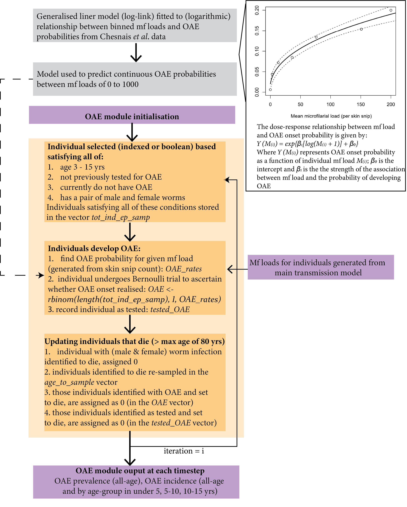

------------------------------------------------------------------------

<!-- badges: start -->
<!-- badges: end -->


<br />

### An individual-based onchocerciasis dynamic model

------------------------------------------------------------------------

## Overview

A individual-based, stochastic model of the *Onchocerca volvulus*
transmission system.

For full model details please see: [Hamley JID, Milton P, Walker M,
Basáñez M-G (2019) Modelling exposure heterogeneity and density
dependence in onchocerciasis using a novel individual-based transmission
model, EPIONCHO-IBM: Implications for elimination and data needs. PLoS
Negl Trop Dis 13(12):
e0007557](https://doi.org/10.1371/journal.pntd.0007557)

The process overview within EPIONCHO-IBM, describing the steps through a
model run which reflect changes in the host/vector and parasite
life-cycle, is presented here:


Other publications utilizing and/or developing EPIONCHO-IBM include:

[Hamley JID, Walker M, Coffeng LE, Milton P, de Vlas SJ, Stolk WA,
Basáñez MG. Structural Uncertainty in Onchocerciasis Transmission Models
Influences the Estimation of Elimination Thresholds and Selection of Age
Groups for Seromonitoring. J Infect Dis. 2020 Jun 11;221(Suppl
5):S510-S518.](https://doi.org/10.1093%2Finfdis%2Fjiz674)

[Walker M, Hamley JID, Milton P, Monnot F, Pedrique B, Basáñez MG.
Designing antifilarial drug trials using clinical trial simulators. Nat
Commun. 2020 Jun
1;11(1):2685.](https://doi.org/10.1038/s41467-020-16442-y)

[Hamley JID, Blok DJ, Walker M, Milton P, Hopkins AD, Hamill LC, Downs
P, de Vlas SJ, Stolk WA, Basáñez MG. What does the COVID-19 pandemic
mean for the next decade of onchocerciasis control and elimination?
Trans R Soc Trop Med Hyg. 2021 Mar
6;115(3):269-280.](https://doi.org/10.1093/trstmh/traa193)

[Stolk WA, Blok DJ, Hamley JID, Cantey PT, de Vlas SJ, Walker M, Basáñez
MG. Scaling-Down Mass Ivermectin Treatment for Onchocerciasis
Elimination: Modeling the Impact of the Geographical Unit for Decision
Making. Clin Infect Dis. 2021 Jun 14;72(Suppl
3):S165-S171.](https://doi.org/10.1093/cid/ciab238)

[Walker M, Hamley JID, Milton P, Monnot F, Kinrade S, Specht S, Pedrique
B, Basáñez MG. Supporting Drug Development for Neglected Tropical
Diseases Using Mathematical Modeling. Clin Infect Dis. 2021 Sep
15;73(6):e1391-e1396. doi:
10.1093/cid/ciab350.](https://doi.org/10.1093%2Fcid%2Fciab350)

## Installation

You can install the development version of EPIONCHO.IBM from
[GitHub](https://github.com/) with:

``` r
# install.packages("devtools")
# install.packages("remotes")
remotes::install_github("mrc-ide/EPIONCHO.IBM")
```

## Using EPIONCHO-IBM

For a detailed practical guide please see the [Installing and Running
EPIONCHO-IBM](https://github.com/mrc-ide/EPIONCHO.IBM/blob/master/vignettes/Running_EPIONCHO_IBM.Rmd)
vignette

For a detailed practical guide/demo for running more complex interventions, with variable MDA coverage, variable timing (e.g., some round of annual and biannual MDA),
and inclusion of vector control, please see the [Running complex intervention guide for EPIONCHO-IBM](https://github.com/mrc-ide/EPIONCHO.IBM/blob/master/vignettes/Running_complex_interventions.Rmd) vignette

## Morbidity Extension

EPIONCHO-IBM has been extended to include a OAE module, to simulate OAE prevalence and incidence. Below, we present a flow chart detailing the process overview for the the morbidity module, how this module is parameterised, and how this module connects to the main transmission model. The section below this one describes OAE.


Morbidity Flowchart             |  Eye Disease Flowchart
:-------------------------:|:-------------------------:
  |  


For a detailed practical guide/demo for running the onchocerciasis-associated epilepsy (OAE) module, please see the [Running OAE in EPIONCHO-IBM](https://github.com/mrc-ide/EPIONCHO.IBM/blob/master/vignettes/Running_EPIONCHO_IBM_with_morbidity.Rmd) vignette

## Onchocerciasis-associated epilepsy (OAE) extension

EPIONCHO-IBM has been extended to include a OAE module, to simulate OAE prevalence and incidence. Below, we present a flow chart detailing the process overview for the OAE module, how this module is parameterised (dose-response relationship between mf load and OAE onset probability), and how this module connects to the main transmission model. 



For a detailed practical guide/demo for running the onchocerciasis-associated epilepsy (OAE) module, please see the [Running OAE in EPIONCHO-IBM](https://github.com/mrc-ide/EPIONCHO.IBM/blob/master/vignettes/Running_EPIONCHO_IBM_with_OAE.Rmd) vignette

## Ov16 Extension
EPIONCHO-IBM has been extended to output Ov16 seroprevalence. The seroprevalence outputed was determined by testing hypotheses for seroconversion (ranging from prepatent to patent) and seroreversion (ranging from instant seroreversion to lifelong immunity), as defined in [TBD]. The main model outputs the two best fit hypotheses. While both hypotheses assume seroconversion occurs in the presence of a mating worm pair and the production of any microfilariea, they differ in their seroreversion assumptions, one assuming there is no seroreversion (lifelong immunological memory), and the other with finite immunologicla momery (seroreversion occurs the absence of infection, defined as the absence of worms and larvae in a host).

A practical guide/demo can be found in the [Running Ov16 in EPIONCHO-IBM vignette](https://github.com/mrc-ide/EPIONCHO.IBM/blob/master/vignettes/Running_EPIONCHO_IBM_using_Ov16.Rmd) vignette. The code and a [vignette to run the model with all tested hypotheses](https://github.com/mrc-ide/EPIONCHO.IBM/blob/ov16/vignettes/Running_EPIONCHO_IBM_Ov16.Rmd) can be found in the Ov16 branch.